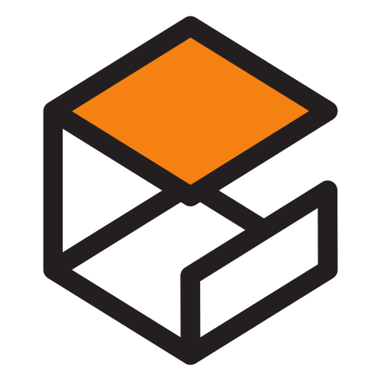
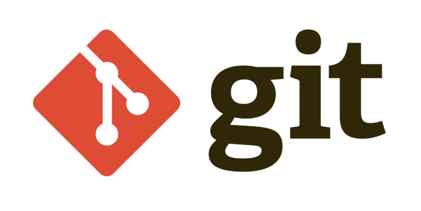
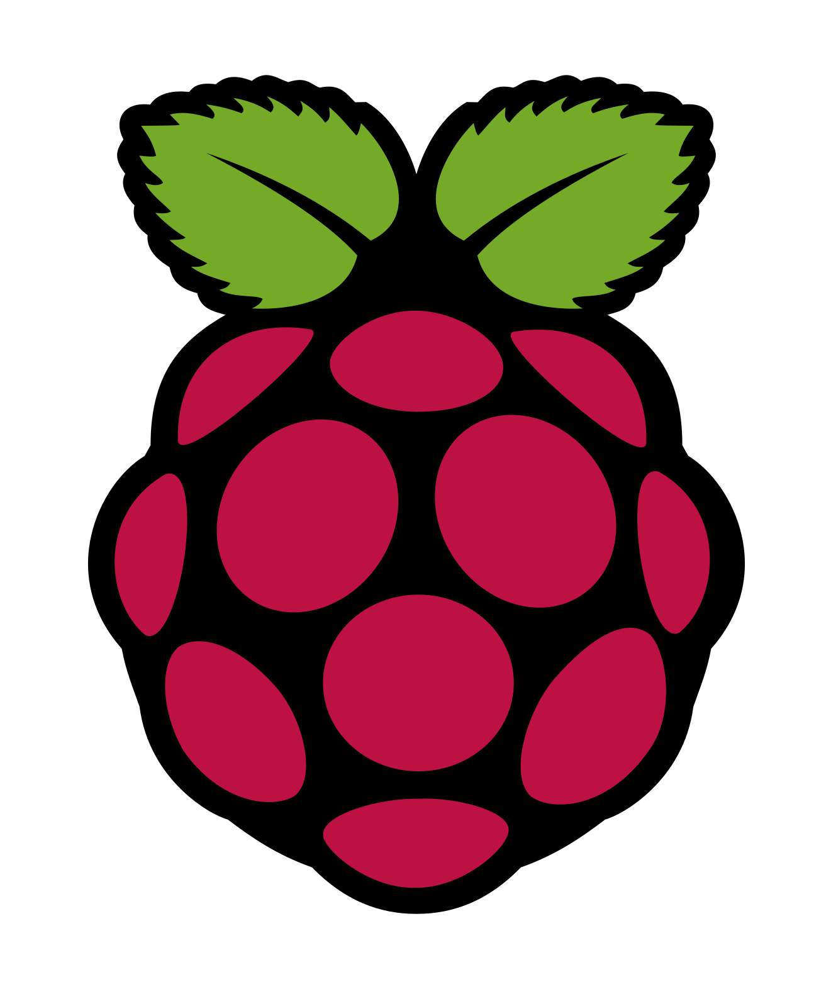
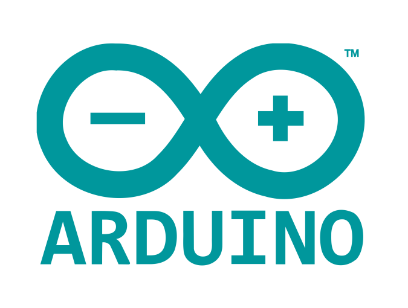

<h4>Hello, I am Aditya Patil, a Robotics System Designer with a primary focus on designing and developing control software for autonomous mobile robots utilizing ROS. My expertise lies in Sensor-Integration, Perception and Mapping for a autonomous robot. I am also a seasoned maker, indulging in the design and development of mini-robots, where I explore different technologies and methods for seamless hardware and software integrations.</h4>
 

  <b>Languages and tools:</b>

	
	
	
	 
  
  
  
  
	 
  
  
  
   
  
  

  

 
 
 
<b>Connect with me:</b>
 
 

  

