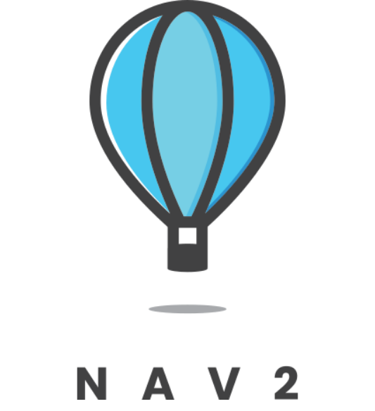
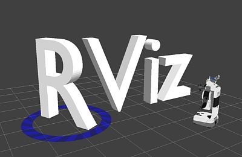

<h2 align="center">Hey! 👋</h2>

I am Aditya Patil, a Robotics System Designer with a primary focus on designing and developing control software for <b>Autonomous Mobile Robots</b> and <b>Manipulators</b> utilizing ROS. My expertise lies in Sensor-Integration, Perception, Mapping for a autonomous robots and motion control for manipulators.  I am also a seasoned maker, indulging in the design and development of mini-robots, where I explore different technologies and methods for seamless hardware and software integrations.

 

<h2 align="center">Languages and tools</h2>

	
	
	
	<!--  -->
   
  
  
  <!-- 
   -->
  <!--  -->
	<!--  -->
   
  
  
  <!--  -->
  <!--  -->
   
  
  

 

<h2 align="center">Active Work</h2>

  

    
    
    
    <!--  -->
  

 
<h2 align="center">My Stats</h2>

 
 
 
<b>Connect with me:</b>
 
 

<!--  -->

  

